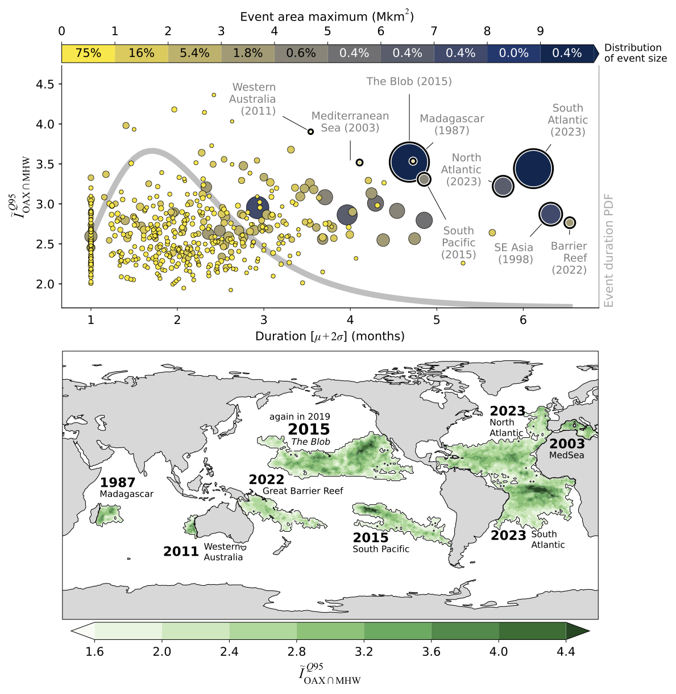

# Code for satellite-based compound MHWs and OAXs

| Title        | Recent history of surface ocean acidification extremes that compound marine heat waves |
|--------------|----------------------------------------------------------------------|
| Journal      | Submitted to AGU Advances                                            |
| Authors      | [Luke Gregor](https://orcid.org/0000-0001-6071-1857) and [Nicolas Gruber](https://orcid.org/0000-0002-2085-2310)|
| Data product | https://oceanco2.github.io/co2-products/?product=oceansoda-ethzv1    |

 ---




**Plain Language Summary**: This study examines the recent history of “compound extremes” in the ocean, where marine heatwaves and ocean acidification extremes occur simultaneously. Using observational data from 1982 to 2024, the research reveals that these compound events are happening more frequently than would be expected by chance, particularly in the low-to-mid latitudes. Conversely, they are rare in the Equatorial Pacific and polar regions. These compound events are most prevalent during summer and are influenced primarily by the El Niño/Southern Oscillation. While most of these events are relatively small and short-lived, there have been a few exceptionally large, long, and intense occurrences. Some of the most notable events include: "The Blob," in the Northeast Pacific in 2015; the longest-lasting event that occurred in the Southeast Asia region from 1998 to 1999; and the most intense event that occurred off Western Australia in 2011. These compound extremes happen in areas where the warming from a marine heatwave also leads to an increase in ocean acidity. This phenomenon is most common in regions of the ocean that are permanently stratified, meaning they have distinct layers of water that do not mix well.


## Step by step guide to this repo

1. Install `uv` on your system following these instructions: https://docs.astral.sh/uv/getting-started/installation/
2. Clone this repo to your computer
3. Perpare data with Python scripts (#0-5) using steps below
4. Plot figures using `marimo` with script #6 - it's an alternative to Jupyter Notebooks
```bash
# compute extremes 
uv run python scripts/0_fetch_datasets.py  # downloads OceanSODA-ETHZ and CMEMS-LSCE
uv run python scripts/1_compute_extremes.py  # Computes extremes for default parameters
uv run python scripts/2_baseline_sensitivities.py  # Computes extremes for both datasets using suite of paramters

# compute intermediate data for plotting
uv run python scripts/3_calc_spatial_stats.py  
uv run python scripts/4_calc_event_stats.py
uv run python scripts/5_compute_carbsys_drivers.py
```

Now comes the `marimo` part. If you run into troubles with Safari, try Chrome. 
```bash
uv run marimo edit scripts/6_figures_mo.py
```

This then runs in your browser as Jupyter Notebooks do. 
You need to run the first two cells but after that, you can start with any figure heading. 
Note that figures for extremes with annotations may not be exactly the same as in the paper due to differences in blob numbering index. 
